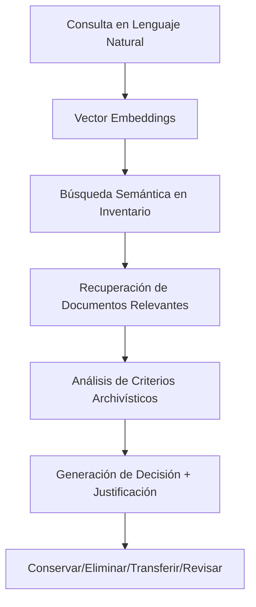

# 🤖 Simulador de Macrovaloración Documental con RAG

[](https://creativecommons.org/licenses/by-sa/4.0/)
[](https://github.com/tu-usuario/macrovaloracion-rag)
[](https://www.w3.org/WAI/WCAG21/quickref/)

Un simulador interactivo web que utiliza tecnologías de Retrieval-Augmented Generation (RAG) para asistir en procesos de macrovaloración documental, permitiendo tomar decisiones archivísticas inteligentes basadas en estándares internacionales.

## 🎯 Características Principales

- ✅ **Carga de inventarios**: Soporte para CSV y JSON con tabla editable
- 🤖 **Motor RAG simulado**: Consultas en lenguaje natural para valoración documental
- 📊 **Visualizaciones dinámicas**: Gráficos interactivos y mapas de calor temporales
- 📤 **Exportación múltiple**: JSON, CSV, TRD y reportes PDF
- ♿ **Totalmente accesible**: Cumple estándares WCAG 2.1 AA
- 🎓 **Modo capacitador**: Guía paso a paso para aprendizaje
- ⚖️ **Criterios personalizables**: Ajuste de pesos para valoración archivística

## 📖 Conceptos Fundamentales

### ¿Qué es la Macrovaloración Documental?

La **macrovaloración documental** es un enfoque metodológico desarrollado por archivistas como Terry Cook y Joan Schwartz que busca evaluar el valor de los documentos no de forma individual, sino como conjuntos documentales que reflejan funciones, actividades y contextos organizacionales más amplios.

#### Principios Clave:
- **Enfoque funcional**: Valoración basada en las funciones que generaron los documentos
- **Análisis contextual**: Consideración del entorno social, político y organizacional
- **Perspectiva holística**: Evaluación de conjuntos documentales en lugar de documentos aislados
- **Criterios múltiples**: Integración de valores primarios (administrativo, legal, fiscal) y secundarios (histórico, investigativo, evidencial)

### ¿Qué son los Metadatos Semánticos?

Los **metadatos semánticos** son información estructurada que describe el contenido, contexto y relaciones de los documentos utilizando ontologías y vocabularios controlados que permiten a las máquinas "entender" el significado de la información.

#### Estándares Aplicados:
- **SKOS (Simple Knowledge Organization System)**: Para vocabularios controlados y taxonomías
- **Dublin Core**: Metadatos básicos de descripción
- **PREMIS**: Metadatos de preservación digital
- **EAD (Encoded Archival Description)**: Descripción archivística codificada

#### Ejemplo de Metadatos Semánticos:
```json
{
  "id": "DOC-001",
  "skos:concept": ["contratos", "adquisición", "bienes", "servicios"],
  "dc:subject": "Contrato de adquisición de equipos",
  "dc:date": "2020-03-15",
  "archival:hasFunction": "AdquisicionBienes",
  "archival:isPartOf": "ProcesosContractuales",
  "premis:hasValue": {
    "administrativo": "high",
    "legal": "high", 
    "historico": "medium"
  }
}
```

### ¿Qué es RAG y cómo se aplica en Archivos?

**RAG (Retrieval-Augmented Generation)** es una arquitectura de inteligencia artificial que combina:
1. **Recuperación**: Búsqueda de información relevante en una base de conocimiento
2. **Aumentación**: Enriquecimiento del contexto con información recuperada
3. **Generación**: Producción de respuestas contextualizadas usando modelos de lenguaje

#### Aplicación en Gestión Documental:



#### Ventajas del RAG en Archivos:
- **Democratización**: Permite consultas en lenguaje natural sin conocimiento técnico
- **Consistencia**: Aplicación uniforme de criterios archivísticos
- **Trazabilidad**: Justificaciones transparentes para cada decisión
- **Escalabilidad**: Procesamiento de grandes volúmenes documentales
- **Actualización**: Incorporación de nuevas normativas sin reprogramación

## 🚀 Instalación y Uso

### Requisitos Previos
- Navegador web moderno (Chrome, Firefox, Safari, Edge)
- JavaScript habilitado
- No requiere instalación de software adicional

### Ejecución Local

1. **Clonar el repositorio**:
```bash
git clone https://github.com/tu-usuario/macrovaloracion-rag.git
cd macrovaloracion-rag
```

2. **Abrir en navegador**:
```bash
# Opción 1: Abrir directamente
open index.html

# Opción 2: Servidor local simple con Python
python -m http.server 8000
# Luego visitar http://localhost:8000

# Opción 3: Con Node.js
npx http-server
```

### Uso en GitHub Pages

1. Fork este repositorio
2. Activa GitHub Pages en Settings
3. Accede a `https://tu-usuario.github.io/macrovaloracion-rag`

## 🎮 Guía de Uso

### 1. Cargar Inventario Documental

#### Opción A: Datos de Ejemplo
- Haz clic en "📋 Cargar Datos de Ejemplo"
- Se cargarán 6 documentos de muestra con metadatos completos

#### Opción B: Archivo Propio
**Formato CSV:**
```csv
id,serie,fecha,palabrasClave,extracto,relacionOntologica,valorPrimario,valorSecundario
DOC-001,Contratos,2020-03-15,"contrato,adquisición","Contrato de equipos","isPartOf:ProcesosContractuales","Administrativo,Legal","Evidencial"
```

**Formato JSON:**
```json
[
  {
    "id": "DOC-001",
    "serie": "Contratos de Adquisición",
    "fecha": "2020-03-15",
    "palabrasClave": "contrato, adquisición, bienes",
    "extracto": "Contrato de adquisición de equipos",
    "relacionOntologica": "isPartOf:ProcesosContractuales",
    "valorPrimario": "Administrativo, Legal, Fiscal",
    "valorSecundario": "Evidencial, Informativo"
  }
]
```

### 2. Realizar Consultas RAG

#### Ejemplos de Consultas:
- `"¿Qué documentos deben conservarse permanentemente por su valor histórico?"`
- `"¿Cuáles documentos pueden eliminarse después de 5 años?"`
- `"¿Qué documentos deben transferirse al archivo histórico?"`
- `"Analiza los contratos y determina su retención"`

#### Tipos de Respuesta:
- 🟢 **CONSERVAR**: Valor permanente, conservación indefinida
- 🔴 **ELIMINAR**: Sin valor secundario, eliminación autorizada
- 🔵 **TRANSFERIR**: Transferencia a archivo histórico
- 🟡 **REVISAR**: Requiere análisis adicional

### 3. Interpretar Visualizaciones

#### Gráfico Circular de Decisiones
Muestra la distribución porcentual de decisiones de valoración.

#### Mapa de Calor Temporal
Identifica patrones temporales en la producción documental.

#### Distribución por Series
Analiza la cantidad de documentos por serie documental.

### 4. Exportar Resultados

#### Formatos Disponibles:
- **JSON**: Datos completos con metadatos
- **CSV**: Tabla para análisis en Excel/Calc
- **TRD**: Tabla de Retención Documental
- **PDF**: Reporte ejecutivo (en desarrollo)

## ⚖️ Criterios Archivísticos

### Valores Primarios (Utilitarios)
- **Administrativo**: Utilidad para gestión corriente
- **Legal**: Valor probatorio y jurídico
- **Fiscal**: Relevancia tributaria y presupuestal
- **Contable**: Importancia para control financiero

### Valores Secundarios (Patrimoniales)
- **Histórico**: Fuente para investigación histórica
- **Investigativo**: Utilidad para investigación académica
- **Evidencial**: Testimonio de actividades institucionales
- **Informativo**: Contenido informativo único

### Matriz de Decisión

| Valor Primario | Valor Secundario | Decisión Recomendada | Tiempo Retención |
|----------------|------------------|----------------------|------------------|
| Alto | Alto | Conservar | Permanente |
| Alto | Medio | Transferir | 10-20 años |
| Alto | Bajo | Transferir | 5-10 años |
| Medio | Alto | Conservar | Permanente |
| Medio | Medio | Transferir | 5-10 años |
| Medio | Bajo | Revisar | Variable |
| Bajo | Alto | Conservar | Permanente |
| Bajo | Medio | Revisar | Variable |
| Bajo | Bajo | Eliminar | 1-5 años |

## 🧠 Algoritmo RAG Simulado

### Procesamiento de Consultas

1. **Análisis Semántico**:
   - Tokenización de la consulta
   - Identificación de términos clave archivísticos
   - Mapeo a conceptos SKOS

2. **Recuperación**:
   - Búsqueda por palabras clave en metadatos
   - Análisis de relaciones ontológicas
   - Scoring por relevancia semántica

3. **Evaluación de Criterios**:
   ```javascript
   function evaluarDocumento(documento, criterios) {
     let score = 0;
     
     // Valores primarios
     if (documento.valorPrimario.includes('Legal')) score += criterios.legal;
     if (documento.valorPrimario.includes('Administrativo')) score += criterios.administrativo;
     if (documento.valorPrimario.includes('Fiscal')) score += criterios.fiscal;
     
     // Valores secundarios
     if (documento.valorSecundario.includes('Histórico')) score += criterios.historico;
     
     return score;
   }
   ```

4. **Generación de Decisión**:
   - Score > 70: Conservar permanentemente
   - Score 40-70: Transferir a archivo histórico
   - Score < 40: Revisar o eliminar

### Justificaciones Automáticas

El sistema genera justificaciones basadas en:
- **Normativa aplicable**: ISO 15489, ISO 30300
- **Criterios de valoración**: Valores identificados
- **Contexto temporal**: Antigüedad del documento
- **Series documentales**: Tipología específica

## 🎓 Modo Capacitador

### Funcionalidades Pedagógicas

1. **Guía Paso a Paso**: Navegación asistida por las funcionalidades
2. **Barra de Progreso**: Visualización del avance en el aprendizaje
3. **Contexto Teórico**: Explicaciones de conceptos archivísticos
4. **Ejercicios Prácticos**: Casos de estudio con datos reales

### Competencias Desarrolladas

- **Valoración documental**: Aplicación de criterios archivísticos
- **Tecnologías emergentes**: Comprensión de IA en archivos
- **Metadatos semánticos**: Estructuración de información
- **Normativa internacional**: ISO 15489, ISO 30300, ISO 14721

## 🔧 Arquitectura Técnica

### Frontend
- **HTML5**: Estructura semántica accesible
- **CSS3**: Diseño responsivo con variables CSS
- **JavaScript ES6+**: Funcionalidad interactiva
- **Chart.js**: Visualizaciones dinámicas

### Accesibilidad (WCAG 2.1 AA)
- **Navegación por teclado**: Tab, Enter, Escape
- **Lectores de pantalla**: ARIA labels y roles
- **Contraste**: Ajustable dinámicamente
- **Texto escalable**: Zoom hasta 200%

### Estándares Implementados
- **Dublin Core**: Metadatos básicos
- **SKOS**: Vocabularios controlados
- **OAIS**: Modelo de preservación
- **METS/PREMIS**: Metadatos técnicos

## 🧪 Casos de Uso

### 1. Archivo Universitario
```
Consulta: "¿Qué expedientes académicos deben conservarse permanentemente?"
Resultado: Conservar expedientes de programas acreditados y graduados destacados
Justificación: Valor histórico para investigación educativa e institucional
```

### 2. Archivo Municipal
```
Consulta: "¿Cuáles actas de concejo pueden eliminarse?"
Resultado: Conservar todas las actas del concejo municipal
Justificación: Valor histórico y legal permanente según normativa archivística
```

### 3. Archivo Empresarial
```
Consulta: "Evalúa la retención de contratos de servicios menores"
Resultado: Eliminar después de 7 años
Justificación: Valor administrativo y fiscal cumplido según normativa tributaria
```

## 🤝 Contribuciones

### Cómo Contribuir

1. **Fork** el repositorio
2. **Crea** una rama para tu feature (`git checkout -b feature/AmazingFeature`)
3. **Commit** tus cambios (`git commit -m 'Add some AmazingFeature'`)
4. **Push** a la rama (`git push origin feature/AmazingFeature`)
5. **Abre** un Pull Request

### Áreas de Mejora

- [ ] Integración con APIs de ChatGPT/Claude
- [ ] Conectores para SGDEA existentes
- [ ] Exportación a formatos EAD y METS
- [ ] Workflows de aprobación colaborativa
- [ ] Integración con vocabularios SKOS reales
- [ ] Módulo de machine learning para mejora continua

## 📚 Recursos Adicionales

### Documentación Archivística
- [ISO 15489-1:2016 - Gestión de documentos](https://www.iso.org/standard/62542.html)
- [ISO 30300:2011 - Sistemas de gestión para documentos](https://www.iso.org/standard/53732.html)
- [ISO 14721:2012 - OAIS Reference Model](https://www.iso.org/standard/57284.html)

### Tecnologías RAG
- [Retrieval-Augmented Generation for Knowledge-Intensive NLP Tasks](https://arxiv.org/abs/2005.11401)
- [Dense Passage Retrieval for Open-Domain Question Answering](https://arxiv.org/abs/2004.04906)

### Metadatos Semánticos
- [SKOS Simple Knowledge Organization System](https://www.w3.org/2004/02/skos/)
- [Dublin Core Metadata Initiative](https://www.dublincore.org/)
- [PREMIS Data Dictionary](https://www.loc.gov/standards/premis/)

## 📄 Licencia

Este proyecto está licenciado bajo **Creative Commons Attribution-ShareAlike 4.0 International**.

### Usted es libre de:
- **Compartir**: Copiar y redistribuir el material en cualquier medio o formato
- **Adaptar**: Remezclar, transformar y construir a partir del material

### Bajo los siguientes términos:
- **Atribución**: Debe dar crédito apropiado
- **CompartirIgual**: Si remezcla, transforma o construye sobre el material, debe distribuir sus contribuciones bajo la misma licencia

[](http://creativecommons.org/licenses/by-sa/4.0/)

## 👥 Créditos

### Desarrollado por Jhon Alexander Gonzalez Florez  < http://archivistadigital.com > <jhon.gonzalez@gmail.com>
**Consultor en Gestión Documental Electrónica y Preservación Digital**
- Especialista en estándares ISO 15489, ISO 30300, ISO 14721
- Experto en tecnologías RAG aplicadas a archivos
- Investigador en metadatos semánticos y accesibilidad web

### Basado en
- Metodologías de Terry Cook y Joan Schwartz
- Estándares internacionales de descripción archivística
- Marcos de preservación digital OAIS
- Principios de accesibilidad universal WCAG

## 📞 Contacto y Soporte  

### Reportar Issues
Utiliza el [sistema de issues de GitHub](https://github.com/gibco/macrovaloracion-rag/issues) para:
- 🐛 Reportar bugs
- 💡 Sugerir mejoras
- 📖 Solicitar documentación
- ❓ Hacer preguntas técnicas

### Discusiones
Únete a las [Discussions](https://github.com/gibco/macrovaloracion-rag/discussions) para:
- 💬 Compartir casos de uso
- 🤝 Colaborar en mejoras
- 📚 Intercambiar conocimientos archivísticos

---

<div align="center">

**🏛️ Transformando la gestión documental con inteligencia artificial 🤖**

[Demo Live](https://tu-usuario.github.io/macrovaloracion-rag) | [Documentación](https://github.com/tu-usuario/macrovaloracion-rag/wiki) | [Contribuir](CONTRIBUTING.md)

</div>
